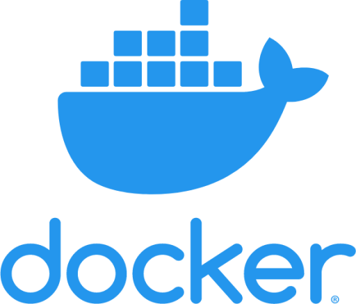
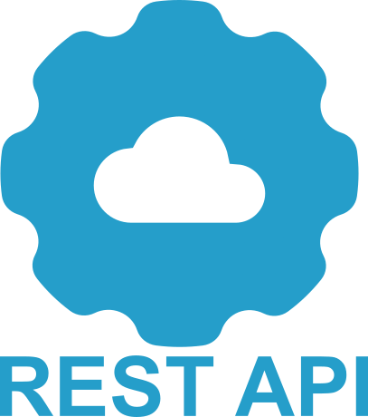
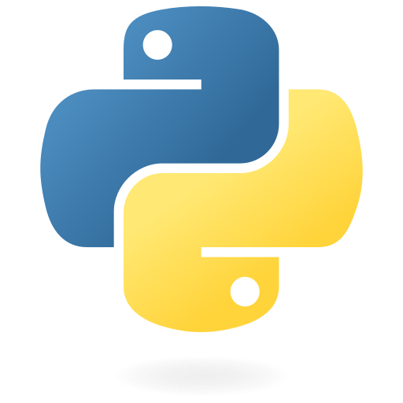
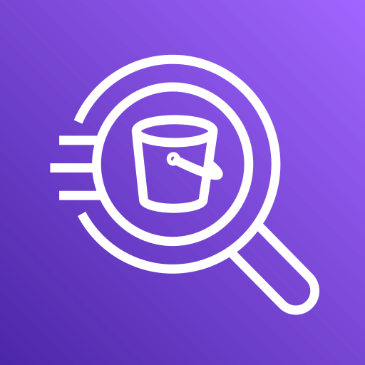
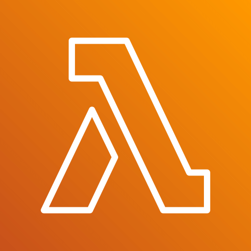

<!-- Animated header -->

##  I am particularly interested in:

 
 

## 🤖 Local AI / LLM tinkering:

 

  
 

 
 

 
 

## 🌱 I’m currently learning:

- Learning Terraform for IaC (Infrastructure as Code) projects I am working on.  
- Learning Go   
- Learning Lua  to do some game development on the side.
- Using the JUCE C++ framework to do some VST development on the side

   

## I use the following tools & technologies:

 

---

 

### I can be reached on:

 
  
 

 

---

 
 

### Open Source Programming Projects I have been helping maintain or maintaining myself

 

| Name  | Frameworks | Description |
| ------------- | ------------- | ------------- |
| [splink](https://github.com/moj-analytical-services/splink)  |     |   Data Linkage at scale package      |
| [splink_graph](https://github.com/moj-analytical-services/splink_graph)  |    |   Graph Theoretical metrics at scale |
| [splink_scalaudfs](https://github.com/moj-analytical-services/splink_scalaudfs)  |     | Scala Linkage UserDefinedFunctions for optimal performance  |

 

### Some code stats

 
 

 
 

### Yes. I am a cat person

 
 

Dont mind me I am just pressing keys randomly until something good happens on the screen

<!--
**mamonu/mamonu** is a ✨ _special_ ✨ repository because its `README.md` (this file) appears on your GitHub profile.

Here are some ideas to get you started:

- 🔭 I’m currently working on ...
- 🌱 I’m currently learning ...
- 👯 I’m looking to collaborate on ...
- 🤔 I’m looking for help with ...
- 💬 Ask me about ...
- 📫 How to reach me: ...
- 😄 Pronouns: ...
- ⚡ Fun fact: ...
-->
